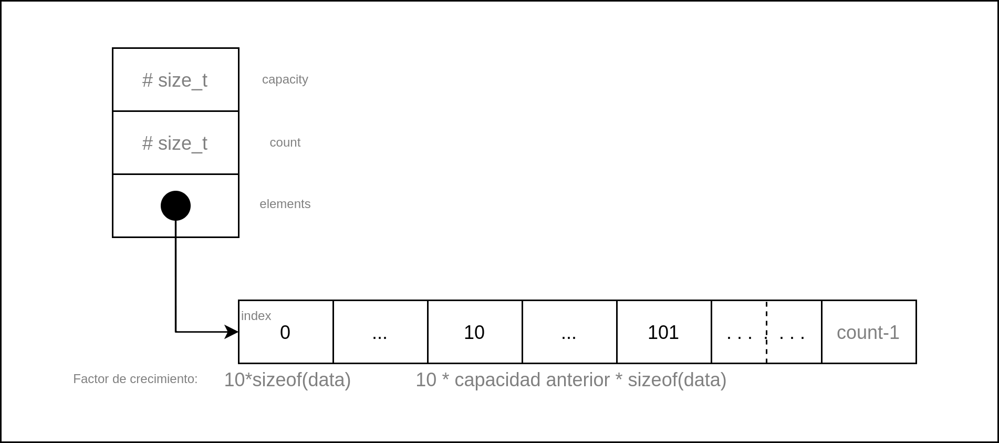
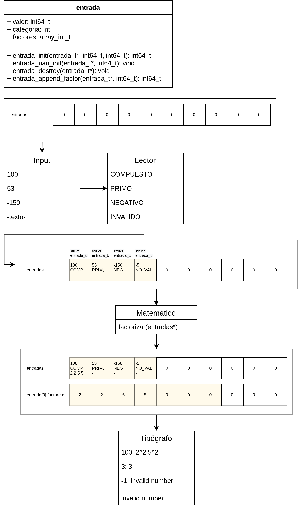

# Diseño de la solución

## **Descripción**

Tomando en cuenta que **las funciones de lectura, calculo e impresión deben estar separadas e invocarse en secuencia en ese orden** y que además **la factorización prima se calcula de manera serial**, tuve la disposición de hacerlo de la siguiente forma: con **un struct que almacena el valor, su categoria y un arreglo de factores para los enteros compuestos.**

Para comprender el patrón que buscan llevar el programa puede ver el diagrama o consultar el código en pseudocódigo:

- [Controlador del programa](./main.pseudo)
- [Lector de la entrada en datos](./lector.pseudo)
- [Cálculos matemáticos](./matematico.pseudo)
- [Impresión de resultados](./tipografo.pseudo)

Además puede visualizar una simulación de la estructura de datos utilizada más adelante.

---

## Estructura de datos

La estructura de datos utilizada es un arreglo dinámico de enteros de 64 bits de tamaño creado por el profesor Jeisson Hidalgo ([+info.](../README.md)) y adaptado con los ajustes necesarios para manejar los tipos de datos ya mencionados.

### **Ejemplo de entrada, proceso y salida:**

Archivo con tres líneas de datos (compuesto, primo e inválido):

~~~txt
100 
53
-150
-texto-
~~~

---

Otras rutas:  
[README del proyecto](../README.md)
