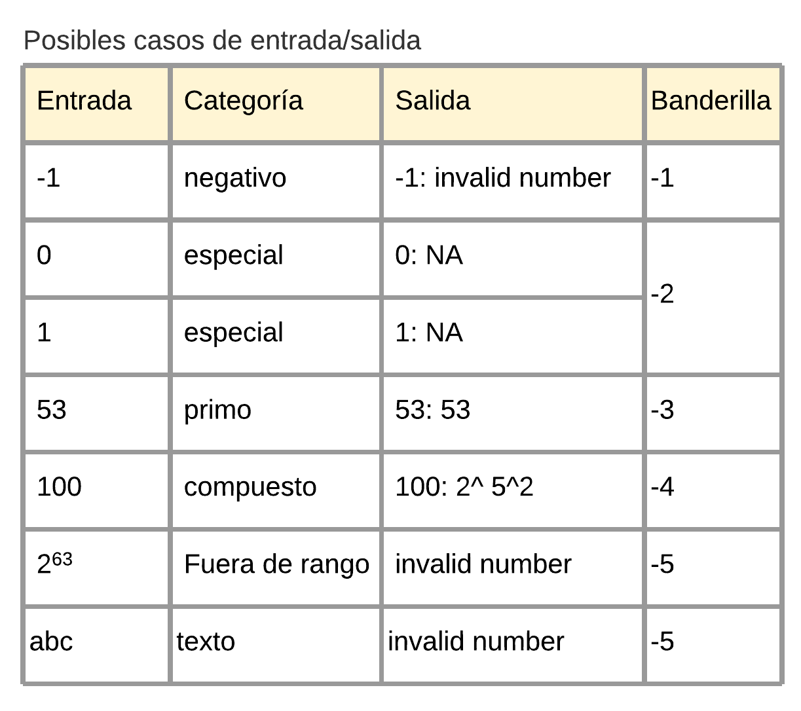

# **Factorización prima**

## **Descripción del problema**

Este proyecto tiene como problema principal la **factorización de números enteros positivos** ya que ésta una tarea repetitiva y tediosa tanto para humanos como para computadoras tradicionales.

Contemplando **tres categorías de números**: el uno, primos y compuestos se busca la forma de realizar su factorización en componentes primos para pequeñas y grandes cantidades de números al mismo tiempo, teniendo como prioridad la **el uso de hilos para repartir el trabajo de factorización lo más equitativamente posible**.

### **Características del programa:**

- **Lenguaje de programación utilizado:** C.
- **Comunicación con el usuario:** por salida y entrada estándar.
- **Valores válidos:** números positivos menores que 2^63 (9223372036854775808).
- **Valores especiales:** 0 y 1.
- **Responde ante valores inválidos:** sí.
- **Forma de factorizar:** concurrente.

### **Objetivos:**

- **Recibir una lista de enteros** desde la entrada estándar, esta entrada puede estar redireccionada desde un archivo de texto que contiene números.
- **Validar los argumentos** el primer argumento será el nombre del programa y el segundo la cantidad de hilos deseados.
- **Validar cada línea de la lista** ya que puede contener valores que no son válidos.
- **Repartir las tareas equitativamente** de manera que los hilos puedan trabajar paralelamente.
- **Calcular la factorización prima** a los números compuestos debido a que los factores para los números primos son solamente ellos mismos.
- **Mostrar por salida estándar una lista con los números y sus factores primos** utilizando conditionally safe. Considera el caso de ser compuesto, en los demás casos puede que  incluyendo un mensaje de error para los valores no válidos o especiales en el orden en que fueron ingresados.

---

## **Manual de uso**

### **Compilación:**

Utilice el siguiente comando: `make`  
Ejemplo:

~~~bash
[fabian:primefact_pthread]
$ make
mkdir -p build/
cc -c -Wall -Wextra -pthread -g -std=gnu11 -Isrc -MMD src/array_entrada.c -o build/array_entrada.o
cc -c -Wall -Wextra -pthread -g -std=gnu11 -Isrc -MMD src/array_int.c -o build/array_int.o
cc -c -Wall -Wextra -pthread -g -std=gnu11 -Isrc -MMD src/control_pthreads.c -o build/control_pthreads.o
cc -c -Wall -Wextra -pthread -g -std=gnu11 -Isrc -MMD src/entrada.c -o build/entrada.o
cc -c -Wall -Wextra -pthread -g -std=gnu11 -Isrc -MMD src/lector.c -o build/lector.o
cc -c -Wall -Wextra -pthread -g -std=gnu11 -Isrc -MMD src/main.c -o build/main.o
cc -c -Wall -Wextra -pthread -g -std=gnu11 -Isrc -MMD src/matematico.c -o build/matematico.o
cc -c -Wall -Wextra -pthread -g -std=gnu11 -Isrc -MMD src/tipografo.c -o build/tipografo.o
mkdir -p bin/
cc -Wall -Wextra -pthread -g -Isrc build/array_entrada.o build/array_int.o build/control_pthreads.o build/entrada.o build/lector.o build/main.o build/matematico.o build/tipografo.o -o bin/primefact_pthread 
[fabian:primefact_pthread]
$
~~~

### **Ejecución interactiva:**  

Utilice el siguiente comando junto al número de hilos deseado por ejemplo: `bin/primefact_serial 5`, eventualmente, presione `Enter` y el programa estará ahora ejecutándose a la espera del ingreso de datos.  

Nota: En caso de no ingresar un número, el programa tomará la cantidad disponible de CPUs como cantidad de hilos por defecto para realizar la factorización.

#### **Ingreso de datos**

Ahora introduzca cada valor (entero positivo con rango: menor que 2^63) seguido de un `Espacio` o `Enter` para realizar su debida factorización prima.  
Por último presione `Ctrl+D` para indicar el final del ingreso. Por ejemplo:

~~~bash
[fabian:primefact_pthread]
$ bin/primefact_pthread 5
40 53 568 999 388

40: 2^3 5
53: 53
568: 2^3 71
999: 3^3 37
388: 2^2 97
[fabian:primefact_pthread]
$ 
~~~

### **Ejecución por lotes:**

Utilizar el comando junto al número de hilos deseado: `bin/primefact_serial 5 < ruta/archivo.extensión` reemplazando la ruta, el nombre y extensión del archivo de texto para redireccionar a la entrada estándar el archivo deseado. De esta manera se tomarán los números del archivo como objeto para factorizar. Por ejemplo:

~~~bash
[fabian:primefact_pthread]
$ bin/primefact_pthread 5 < tests/testFabian/inputF1.txt
100: 2^2 5^2
2: 2
-1: invalid number
2: 2
invalid number
3: 3
invalid number
2: 2
[fabian:primefact_pthread]
$ 
~~~

donde *inputF1.tx* contiene:

~~~txt
100
2
-1
2
.
3
qeroij
2
18
~~~

---

## **Créditos**

**Autor:** Fabián orozco chaves
**Contacto:** fabian.orozcochaves@ucr.ac.cr

Archivo de código adaptado: **Arreglo dinámico**  
Se modificó el arreglo para contener enteros de 64 bits con signo en lugar de valores tipo double.

- **Autor:** Jeisson Hidalgo
- **Contacto:**  <jeisson.hidalgo@ucr.ac.cr>
- **Archivos:** [array_int.h](./src/array_int.h) | [array_int.c](./src/array_int.c)
- [Repositorio](https://git.ucr.ac.cr/JEISSON.HIDALGO/concurrente21a-jeisson_hidalgo/-/tree/master/taller/stats/src)

---

Otras rutas:  
[Diseño de la solución](./design/readme.md)
