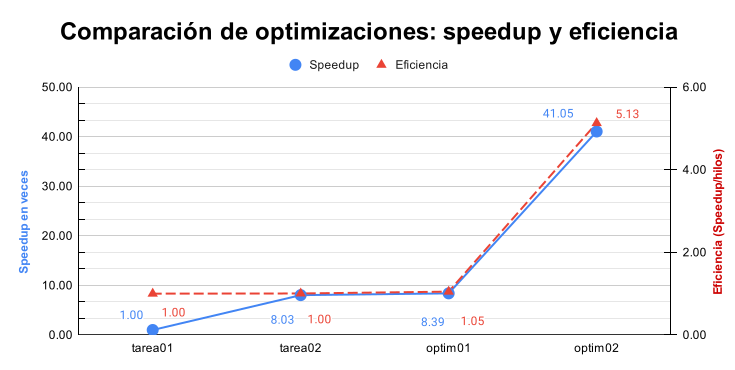
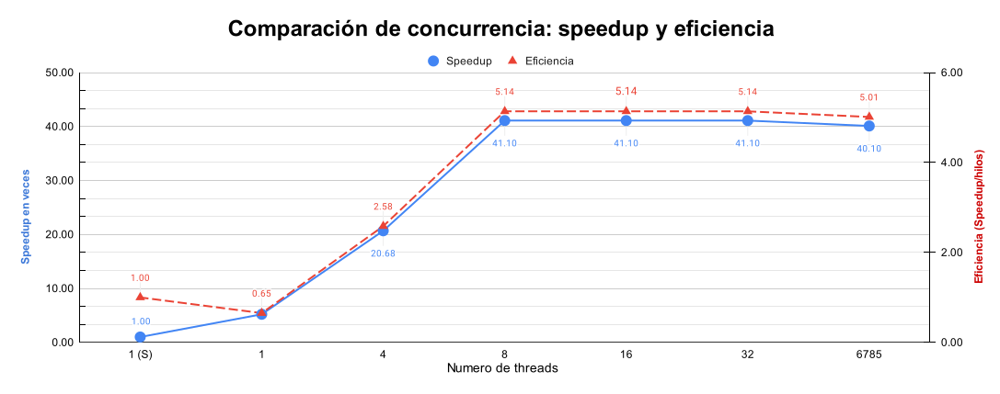

# Documento de reporte

## Descripción

Para este documento de reporte se tomó en cuenta el **tiempo de pared que conlleva realizar la factorización** en cada una de las versiones del proyecto: serial, concurrente, concurrente optimizada01 y optimizada02. Detalles a tener en cuenta:

- **Caso de prueba utilizado:** testF4. Se basa en una combinación del test015 y test021 aportado por el docente, formado de 6785 líneas.  
  
  **Nota:** no se hizo uso del test015 ya que el programa es optimizado y dura menos de 1minuto en ejecutarlo, por otro lado, el test021 genera un enciclamiento por el uso de un algoritmo con algunos números, por ejemplo: 5504660337974370863.

- El tiempo que dura el programa en CPU **está acotado por la subrutina que verifica la categoría de un número (serial)** por lo que el tiempo es el mismo para todas las versiones, sin embargo, para la realización de la factorización de los números, el tiempo muestra un desempeño distinto entre cada una de las anteriores, por lo que se considera el más importante.
  
- **Comparación extra**: se toma en cuenta la diferencia entre tiempos de ejecución del programa completo respecto a las anteriores (serial, concurrente, optimizada01) y la optimizada02 donde se corrige el caso a considerar.
  
- **Medición del tiempo:** Se hace uso de la biblioteca time y la subrutina clock_gettime() para registrar el tiempo de *CPU wall time* con precisión de nanosegundos que tarda en ejecutar los números del caso de prueba.
  
- **Máquina utilizada:** Nodo esclavo del clúster Arenal.

- **Metodología para optimizar:** la sugerida en el curso.

## Optimización01: Mapeo dinámico

### 1. Rendimiento del código antes de realizar las optimizaciones

**Basado en Tarea02:** primefact_pthread  
**Tiempo de ejecución de la factorización:** 20.521504035s  
**Tiempo de ejecución del programa en CPU:** 1869.580430731s

### Lecciones aprendidas 1

Hubo confusión a la hora de tomar el tiempo de ejecución del programa completo ya que no muestra mejora respecto al programa serial.

___

### 2. Profiling

No es necesario realizarlo para esta optimización ya que se conoce la tarea a realizar: mapeo dinámico.

___

### 3. Modificación para mejorar rendimiento de regiones críticas

**Trabajado en Tarea03:** primefact_optimization01  
**Área trabajada:** control_pthread.h y control_pthread.c

Diseño de modificación que incrementará el desempeño: cambio el mapeo utilizado en la tarea02 (por bloque) por un mapeo dinámico. Utilizando solamente datos compartidos y una variable compartida *next_unit* que indica la unidad siguiente a consumir/factorizar por un hilo, la cual está protegida por un mutex. Esto mejorará el rendimiento en casos donde se desconozca la naturaleza de los datos.

### Lecciones aprendidas 3

Con un código modular, el implementar un nuevo tipo de mapeo resulta sencillo de realizar; en este caso se refleja en el pase de pruebas.

___

### 4. Pruebas

Las pruebas con el nuevo diseño optimizado (mapeo dinámico) fueron realizadas de manera exitosa a la primera, además las herramientas como tsan, ubsan, msan, asan, memcheck y hellgrind no reportaron ninguna advertencia.

### Lecciones aprendidas 4

Es útil saber que existen distintos tipos de mapeo que se pueden aplicar a una misma aplicación, manteniendo su correctitud.
___

### 5. Medición de tiempo y comparación

**Nota:** En el caso de prueba inputF5.txt se comprueba el fenómeno de diferencia entre mapeos.

**Basado en Tarea03:** primefact_optimization  
**Tiempo de ejecución de la factorización:** 19.650416779s  
**Tiempo de ejecución del programa en CPU:** 1868.563655789s

Speedup: 1.04432  
Eficiencia: 0.13054  
Como resultado de comparación con el paso 1, puede apreciarse que hubo una diferencia en el tiempo de ejecución de la factorización de: 0.87109

Por otro lado respecto al tiempo de programa en CPU se sabe que este no variará muchísimo ya que está acotado como se mencionó anteriormente.

### Lecciones aprendidas 5

El uso de mapeo dinámico conviene utilizarse cuando no se conoce la naturaleza de los datos.
___

### 6. Bitácora

En este caso el cambio de mapeo (estático por bloque a dinámico) no mostró mucho incremento en el rendimiento ya que el caso de prueba utilizado no se encuentra tan desequilibrado, por lo que en ambos mapeos los hilos tienen una carga de trabajo parecida.

___

## 7. Optimization02: is_compound()

### 7.1 Rendimiento pre-optimizado

**Basado en Tarea03:** primefact_optimization  
**Tiempo de ejecución de la factorización:** 19.650416779s  
**Tiempo de ejecución del programa en CPU:** 1868.563655789s

___

### 7.2 Profiling

Código analizado con la herramienta callgrind de valgrind.

Regiones críticas: is_compound(), el ciclo while que busca si el número se puede descomponer o no.

___

### 7.3 y 7.4 Modificación y pruebas

Diseño de modificación que incrementará el desempeño: método is_compound() con implementación de la criba (mismo que factorización o mejor aún).
La implementación y toma de pruebas fue exitosa.

___

### 7.5 Medición de tiempo y comparación

**Basado en Tarea03:** primefact_optimization02  
**Tiempo de ejecución de la factorización:** 4.015300415  
**Tiempo de ejecución del programa en CPU:** 4.652627172

Speedup: 4.89388  
Eficiencia: 0.611735  
Como resultado de comparación con el paso 5, puede apreciarse que hubo una diferencia en el tiempo de ejecución de la factorización de: 15.6351

Por otro lado respecto al tiempo de programa en CPU también se ve notablemente mejorado ya que ahora la cota que reducía el paralelismo se erradica.

___

### 7.6 Bitácora

En este caso el cambio de descomposición de un número con un algoritmo más eficiente causó un incremento en el programa muy grande ya que reduce la cota del paralelismo al menos en cuatro veces para la concurrencia. El diseño de optimización02 fue exitoso.

___

### 7.7 Nueva optimización

No es necesario realizar otra optimización ya que no se cuenta con los recursos (tiempo) necesarios para hacerla. El programa cuenta con un incremento del desempeño respecto a su versión concurrente anterior (Tarea02).

___

## Comparación de optimizaciones

En esta sección se compara la duración, el incremento de velocidad y la eficiencia para entre las versiones desarrolladas, utilizando ocho threads para las versiones concurrentes. El speedup se calcula respecto a la versión de la tarea01 (serial).

| Versión:        | tarea01 | tarea02 | optim01 | optim02 |
| :---            | ---:    | ---:    | ---:    | ---:    |
| **Duración:**   | 164.82  | 20.52   | 19.65   | 4.02    |
| **Speedup:**    | 1.00    | 8.03    | 8.39    | 41.05   |
| **Eficiencia:** | 1.00    | 1.00    | 1.05    | 5.13    |

Como se puede apreciar en el siguiente gráfico comparativo:

**La duración de la factorización decrementó** conforme se aplicó un grado de concurrencia entre la versin tarea01 y tarea02, decrementando un poco respecto a optim01 con el cambio de mapeo de bloque a dinámico, además, optim02, la cual tiene el menor tiempo de todas con la optimización del uso de la criba mejorada en is_compound() y factorizar_compuesto().

Respecto al speedup *(tiempo anterior/tiempo posterior)* se aprecia un incremento con un tipo reflejo respecto a la duración, lo cual es lo esperado que suceda en teoría, por lo que **los resultados en duración y speedup fueron los deseados, mostrando un incremento del desempeño gracias a las optimizaciones.**

Además de la comparación entre duración y speedup se puede comparar este último con la **eficiencia** a lo que refiere al trabajo realizado por hilo de acuerdo al speedup *(speedup/workers)*, se refleja en el siguiente gráfico:

De éste queda claro que las optimizaciones lograron un **incremento del speedup** casi en todas las versiones, sin embargo, la eficiencia (con 8 hilos para tarea02, optim01 y optim02) se mantuvo constante hasta optim01 mostrando un pequeño aumento en ésta y mostrando una destacable eficiencia para optim02, donde los hilos una labor más eficiente **respecto a la versión serial.**

___

## Comparación de concurrencia

En esta sección se compara la versión optim02 con la versión serial, donde se centrará el análisis al uso de diferente cantidad de hilos creados.

| Hilos:           | 1S     | 1     | 4     | 8     | 16    | 32    | 6785  |
| :---             | ---:   | ---:  | ---:  | ---:  | ---:  | ---:  | ---:  |
| **Duración:**    | 164.82 | 31.64 | 7.97  | 4.01  | 4.01  | 4.01  | 4.11  |
| **Speedup:**     | 1.00   | 5.21  | 20.68 | 41.10 | 41.10 | 41.10 | 40.10 |
| **Eficiencia:**  | 1.00   | 0.65  | 2.58  | 5.14  | 5.14  | 5.14  | 5.01  |

De acuerdo a las mediciones de tiempos de las diferentes versiones se puede generar el siguiente gráfico donde se compara el incremento de velocidad y la eficiencia:

De este gráfico se puede apreciar que la **eficiencia y el speedup crecen casi de la misma forma:** creando entre uno y ocho hilos ambas crecen linealmente, sin embargo cuando se llega a crear dieciséis  hilos o más de estos, la eficiencia y el speedup **dejan de crecer**, lo cual indica que **la cantidad óptima para conseguir el mejor rendimiento se encuentra entre ocho hilos y dieciséis  hilos** (al menos para testF4) y a partir de allí, la creación de más hilos no causan mejoras e incluso por el contrario **podría resultar en un desperdicio de recursos**.

___

Otras rutas

- [README del proyecto](../README.md)
- [Diseño de la solución](../design/readme.md)
- [Hoja de cálculo](../design/documents/hoja_de_calculo.pdf)
